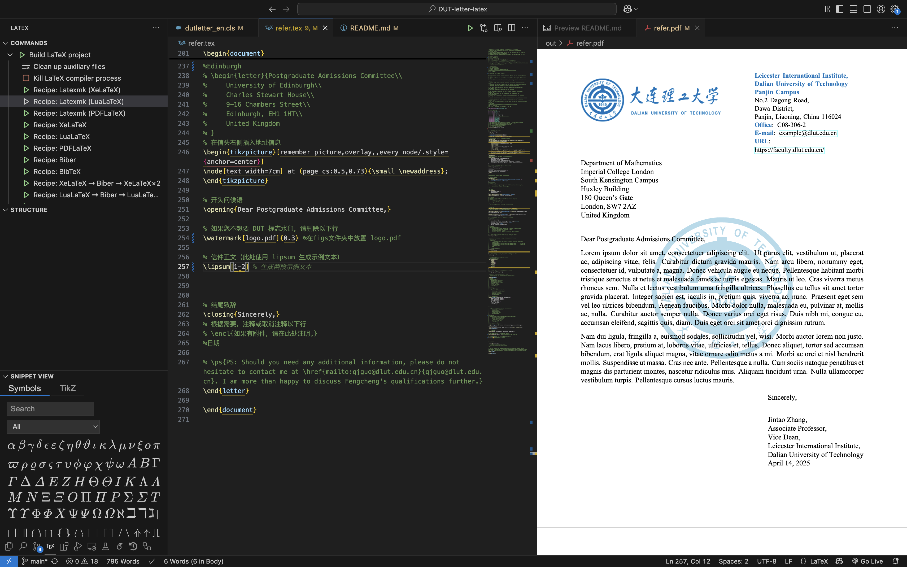

# DUT-letter-latex


[](https://github.com/FrankieeW/DonateME/blob/main/README.md)
## 中文版本
<div align="left">

[](#english-version)
[](#中文版本)
  <!-- <a href="https://github.com/FrankieeW/DonateME/blob/main/README.md" target="_blank">
    
  </a> -->


### 项目概述
大连理工大学的公函模版。（非官方）
实际上 用写推荐信的，祝福大家留学顺利。
该项目提供了 LaTeX 文件。
暂时只用LuaLaTex编译。


- **refer.tex**：模版文件
- **dutletter_en.cls**：类文件
- figs：存放图片的文件夹（有两个logo）
- **refer.pdf**：例子<code>refer.tex</code>编译后的结果。
  <br>  

### 特点

- **自定义格式**：该类文件帮助确保官方文档的一致风格。
- **中英文双语支持**：提供中英文文档说明，方便不同语言使用者参考。(也没人需要英文版吧)

### 安装方法

1. 克隆或下载本仓库。
2. 将下载的 `.tex` 与 `.cls` 文件放置在您的 LaTeX 项目目录中。


### 使用方法
- 在主 `.tex` 文件中调用类文件，例如：
   ```latex
   \documentclass{dutletter_en}
   ```
- 也可以直接使用 `refer.tex` 文件。
- 编译时使用 LuaLaTeX（如果需要水印）。
- 如有需要，可根据项目要求对文件进行修改。

### BUG
- emmm 用LuaLaTex编译。（如果要水印的话），用Xe or PDF LaTex的话水印除了第一页都会很深，记得当年debug好久，最终选择摆烂。


### 贡献

欢迎提交问题或拉取请求（Pull Request），以提出改进意见或报告错误。

### 许可证

本项目遵循 [MIT 许可证](LICENSE)。

### 联系方式

如有疑问或需要支持，请联系 [Email](mailto::frankie.fc.wang@outlook.com)
或访问 [~~Frankie~~](https://blog.frankie.science)。

### 如果你觉得这个项目对你有帮助，欢迎请我喝杯咖啡~

[💰 支持作者](https://github.com/FrankieeW/DonateME/blob/main/README.md)

---
## English Version
### Overview
<div align="left">

[](#english-version)
[](#中文版本)

</div>
Dalian University of Technology letter template. (Unofficial)
Actually, it is used for writing recommendation letters. Best wishes for your study abroad.
This project provides LaTeX files.

- **refer.tex**: Template file.
- **dutletter_en.cls**: Class file for formatting English documents (e.g., letters or reports).
- **figs**: Folder for storing images (contains two logos).
- **refer.pdf**: Example of the compiled result of `refer.tex`.
  <br>  


### Features
- **Custom Format**: The class file helps ensure a consistent style for official documents.
- **Bilingual Support**: Provides bilingual documentation for reference by users of different languages.

### Installation

1. Clone or download the repository.
2. Place the provided `.tex` and `.cls` files in your LaTeX project directory.
3. In your main `.tex` file, include the class file using:
   ```latex
   \documentclass{dutletter_en}
   ```

### Usage

- Compile using LuaLaTeX (if you need watermarks).
- Modify the files as needed for your project requirements.

### Contribution

Feel free to open issues or submit pull requests if you have improvements or bug fixes.

### License

This project is licensed under the [MIT License](LICENSE).

### Contact

For questions or support, please contact [Email](mailto::frankie.fc.wang@outlook.com)
or [~~Frankie~~](https://blog.frankie.science)。


### BUY ME A COFFEE
[💰 BUY ME A COFFEE](https://github.com/FrankieeW/DonateME/blob/main/README.md)

---
